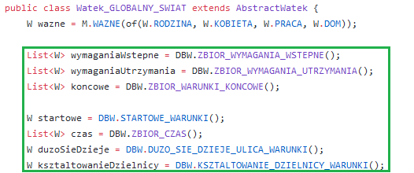
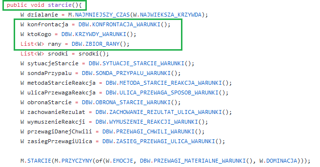
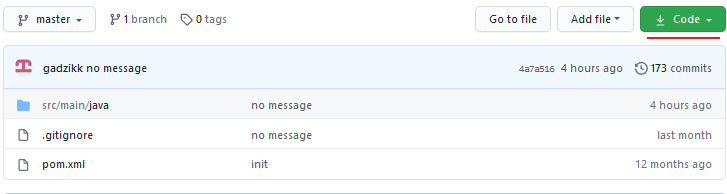
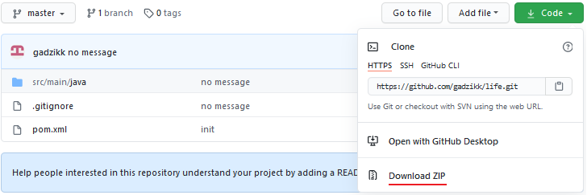
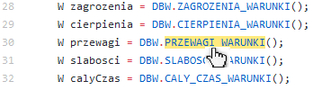
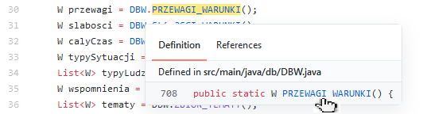
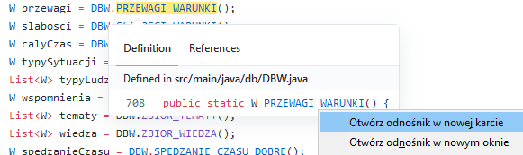
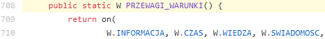

<h2>WSTEP</h2>

ten program pisol wkurwi*ny zyciem wieczny imigRant majacy dostep do wielu globalnych pokoji warunkow miast, rdzennej ludnosci w 2 duzych wojewodztwach Polski w latach od 2016 do 2020.

kazdy z warunkow zostal wiernie odzwieRciedlony i opisany w poszczegolnych watkach, ktore stanowia oddzielne pokoje warunkow, przyczyny skutki zdarzen zjawisk warunkow ktore na siebie nawzajem oddzialuja(wplywaja).

celem tego programu jest <b>USWIADOMIENIE</b>, powstal on na bazie obserwacji i doswiadczen, bardziej swiadomi moga go potraktowac jako przypomnienienie, mniej swiadomi/slabsi, ktorzy nie maja szansy przezycia zdarzen(dostep restrykcyjny) ktore autorowi bylo dane przezyc niniejszym pierwszy raz w historii otrzymuja okazje do zaznajomienia sie z nimi zupelnie za darmo.

Dzieki temu bez doswiadczenia duzych cierpien i bolow osoby otrzymuja dostep do unikalnej wiedzy, aby w dalszej perspektywie byc w stanie dokonac wlasciwej oceny(sondy) sytuacji, zrozumiec zachodzace zdarzenia, podjac dobre decyzje w zyciu i zastosowac ta wiedze w praktyce.

Ten program powstal od polaka dla polakow(wraz z rdzennymi mniejszosciami mieszkajacymi w polsce) i powinien byc ukryty przed zagranicznymi osobami innej rasy niz slowianska/germanska, powinien byc ukryty(w miare mozliwosci) przed zlymi ludzmi choc jest to nieuniknione ze wraz z zwiekszaniem zasiegu stanie sie rowniez dla nich dostepny.

program ten jest o tyle wazny poniewaz odzwierciedla prawdziwa rzeczywistosc i pomaga w jej zrozumieniu, to co mozesz zobaczyc po wyjsciu na ulice jest dokladnie odwzorowane w jednym miejscu, warunki i zjawiska na ulicy powtarzaja sie cyklicznie

program ten rowniez dobrze opisuje moralnosc czynow (WATEK_DOBRA_ZLA) oraz uwidacznia przewage dobra nad zlem, zlo najczesciej samo siebie niszczy, (brak dostepu do dobra).

Droga do dobra wiedzie przez ciezka prace i cierpienie jest to droga ciezsza, zmuszajaca do pracy i przemyslen ale warto ta droga isc zeby nabyc dobrych wartosciowych cech uzytecznych w zyciu i osiagnac to co prawdziwie wartosciowe, 

Droga do zla wiedzie przez przyjemnosci, komfort, zabawe i tymczasowe falszywe przewagi, osoby idace ta droga zwykle szybko osiagaja przewage dzieki sluzeniu osobie wyzszej w hierarchii, nie wyrabiaja porzadanych cech charakteru, sa slabi i nie sprostaja zyciowym wymaganiom.

Autorowi opisanie wszystkich warunkow, relacji i zjawisk w jednym miejscu zajelo rok ciezkiej pracy.

Nad tym programem, zostala wykonana ogromna tytaniczna praca - niejednokrotnie 9 godzin dodatkowego wysilku dzien w dzien po skonczeniu dnia w pracy zarobkowej

Za wykonanie tej pracy autor nigdy nie otrzymal zadnych pieniedzy, dostep jest powszechny i publiczny.

napisana zostala tutaj tylko CZYSTA PRAWDA

***

pozdrowienia dla tych ktorzy natchneli mnie do napisania tego programu, dziekuje tym ktorzy zapewnili opcje dostepu lub pomogli oplaci sie to wam wszystkim.  
pamietam rowniez o tych ktorzy robili wszystko aby utrudnic zycie i napsuc krwi, ten program jest duzym ciosem dla nich, bo od zawsze wykorzystuja nieswiadomych ludzi do swoich celow

<h2>ZAWARTOSC</h2>
zawartosc tresci sklada sie z siedmiu watkow (Watek_GLOBALNY_SWIAT, Watek_ULICA, Watek_LUDZI, Watek_ROZWOJU_CZLOWIEKA, Watek_DOBRO_ZLO, Watek_ZWIAZKEK , Watek_POZANIA_KOBIET_KROTKO), ktore bazuja na kategoriach warunkow (DBW - warunki, DBP - patologie)

przeczytanie calosci dla osoby ktora czyta pierwszy raz powinno zajac nie wiecej niz 2-4 godziny czasu, dla osoby ktora czyta poraz kolejny nie wiecej niz 2 godziny czasu.

tresc zawiera prawdopodobnie wiekszosc warunkow swiatowych dla europy srodkowo wschodniej (co jest fenomenem na skale globalna), zostala ona przedstawiona w mozliwe najprostszy sposob w formie:

W.WARUNEK_A ---> W.WARUNEK_B  
co nalezy czytac:  
WARUNEK_A (po lewej stronie) wywoluje WARUNEK_B (po prawej stronie)  
(LUB)  (przyczyna) ---> (skutek)  
(LUB) WARUNEK_A jest warunkiem poprzedzajacym i koniecznym do zaistnienia WARUNEK_B  
(LUB) WARUNEK_A pozwala na WARUNEK_B

link do calosci: https://github.com/gadzikk/life/tree/master/src/main/java
nalezy wejsc do folderow: db oraz watek, w ktorych jest zawarta cala tresc do innych folderow nie nalezy wchodzic poniewaz nie ma tam zadnej istotnej wiedzy.

<h2>OBJASIENIA DO TRESCI</h2>

STARCIE = walka/konfrontacja  
SONDA = ocena/poddanie ocenie  
OPCJA - warunek opcjonalny moze wystapic lub nie wystapic  
WATEK - zbior warunkow i zjawisk w ogarniczonym zakresie,

WATKI zostaly podzielone na funkcje, funkcja czyli maly zakres w danym watku przykladowo: starcie() dotyczy wydzielonego zakresu dla walki/konfrontacji

M - METODA lub KONTEKST(opakowanie),  
>najprostsze przyklady:  
przyklad kontekstu: M.WAZNE(W.TRZEZWOSC)   
> WAZNE jest tutaj kontekstem, wskazuje ze dany warunek jest wazny

>przyklad metody: M.KONTROLA(W.PRACOWNICY)  
KONTROLA jest w tym przypadku metoda/wykonaniem dzialania kontroli pracownikow

W - WARUNEK, najmniejsza jednostka  
DBW - kategorie i zboiory warunkow, DBP - kategorie i zbiory patologii, 

warunki zostaly polaczone w kategorie(wiele warunkow wystepujacych razem, kategorie mozna rozpoznac po zakonczeniu _WARUNKI() przykladowo: REAKCJE_WARUNKI()),

a nastepnie kategorie zostaly polaczone w zbiory(wiele kategorii wystepujacych razem, zbiory mozna rozpoznac po przedrostku ZBIOR, przykladowo ZBIOR_WARUNKI_KONCOWE())

kategorie oraz zbiory warunkow zostaly umieszczone w watkach, co oznacza ze dane warunki istnieja, sa obecne i aplikowalne w danym watku

 >przykladowo:  
wewnatrz watku Watek_GLOBALNY_SWIAT: 
W startowe = DBW.STARTOWE_WARUNKI();

oznacza ze kategoria STARTOWE_WARUNKI jest obecna, aplikowalna i dotyczy calego globalnego swiata (zielony obszar rysunek ponizej)

>drugi przyklad:  
wewnatrz Watek_ULICA w funkcji starcie()  
KONFRONTACJA_WARUNKI(),

  
oznacza ze kategoria KONFRONTACJA jest obecna, aplikowalna dotyczy tylko ulicy, i tylko w zakresie starcie() czyli walki/konfrontacji

M.CALY_CZAS - oznacza ze dany warunek wystepuje caly czas, caly czas ma miejsce, warunek skutku ma miejsce tylko gdy dziala on nieprzerwanie

>najprostszy przyklad:  
M.OSOBA(M.CALY_CZAS(W.ODDYCHA))  ---> M.OSOBA(W.ZYJE)

co nalezy czytac osoba caly czas oddycha, co skutkuje tym ze zyje, zaprzestanie warunku po lewej stronie(oddychania), skutkuje przestaniem wystepowania warunku po prawej stronie(zycia danej osoby)

<h2>KROTKIE OBJASNIENIE DO WATEK_ULICA</h2>
niektore ze zjawisk w WATEK_ULICA dotycza scisle miast derbowych - dwa kluby (ekipy) walczace nawzajem o wplywy na miescie  

terminologia: ZWIADY, WALKA_SPRZET, HASLO_RDZENNYCH, BIEGAJACY_SPRZET odnosi sie dokladnie do rywalizacji w miescie derbowym  
ponizej wyjasniam znaczenie tych terminow poniewaz nie jest to zadna wiedza tajemna  

ZWIADY - wejscie na teren wroga w celu zdobycia informacji  
WALKA_SPRZET - walka przy pomocy broni(zwykle ostrej)  
HASLO_RDZENNYCH - haslo za pomoca ktorego wiadomo ze jestes po jednej stronie konfliktu, lub jestes z danego terytorium, haslo zwykle znaja rdzenni jest ono przekazywane od starszych do mlodszych za samo mieszkanie na dzielnicy lub czesciej za dzialanie dla jednej ze stron  
BIEGAJACY_SPRZET - osoba walczaca o wplyw dla danej strony konfliktu za pomoca broni(ostrej)  
SAMOCHOD_NA_CHODZIE - samchod z biegajacymi zdolny do akcji na strone przeciwna

Nota: osoby ze wsi moga poprostu niezrozumiec niektorych zjawisk i warunkow z WATEK_ULICA, wczesniej nie majac z nimi stycznosci, chcacy wyjasnienia powinni uderzyc do znajomych osob z miasta z prosba o wyjasnienie

<h2>SKOPIUJ ZAWARTOSC</h2>

Zanim przystapisz do czytania zrob kopie programu na swoim domowym komputerze (ta strona, ktora dzis czytasz w przyszlosci moze zniknac/zostac zablokowana)

wejdz do glownego folderu: https://github.com/gadzikk/life  
kliknij na zielony przycisk CODE, a nastepnie przycisk DOWNLOAD ZIP

  

<h2>INSTRUKCJA</h2>

Z uwagi na to ze wszystkie watki korzystaja z warunkow, nalezy je przyswoic najpierw

Na poczatku nalezy zaznajomic sie z warunkami (w skrocie DBW   
https://github.com/gadzikk/life/blob/master/src/main/java/db/DBW.java)      
nastepnie z patologiami (w skrocie DBP  
https://github.com/gadzikk/life/blob/master/src/main/java/db/DBP.java)

odniesienia w Watkach do warunkow i patolgii sa realizowane za pomoca przedrostkow(prefixow) DBW oraz DBP

przykladowo:  
W przyczyny = DBW.SONDA_PRZYCZYN_WARUNKI();
* (sposob nawigacji szybszy) mamy przedrostek DBW/DBP wiec najezdzamy kursorem myszki na czlon ktory widzimy po kropce w tym wypadku - SONDA_PRZYCZYN_WARUNKI, po podswietleniu na zolto klikamy lewym przyciskiem myszy, nastepnie po wywietleniu dialogu klikamy prawym przyciskiem myszki(lub scrollem) -> otworz w nowej karcie,

w ten sposob przenosimy sie(nawigujemy) do dokladnie tej kategorii warunkow ktora wystapila w watku

  
  

w wyniku na nowej karcie mozemy zobaczyc kategorie warunkow do ktorych chcielismy przejsc, ktora byla przypieta w watku    

* (wolniejszy sposob nawigacji) podobny efekt mozna uzyskac otwierajac w osobnych kartach watek oraz DBW / DBP i po napotkaniu przedrostka wyszukac w karcie przegladarki uzywajac skrotu: CTRL + F wpisujac wyzej wymieniony czlon po kropce, w tym wypadku SONDA_PRZYCZYN_WARUNKI

po przeczytaniu calych warunkow z DBW i DBP nalezy przeczytac watki https://github.com/gadzikk/life/tree/master/src/main/java/watki  

w kolejnosci:
1. Watek_GLOBALNY_SWIAT,  
2. Watek_ULICA, 
3. Watek_LUDZI,   
4. Watek_ROZWOJU_CZLOWIEKA,   
5. Watek_DOBRO_ZLO,  
(opcjonalnie) 6. Watek_ZWIAZEK,  
(opcjonalnie) 7. Watek_POZANIA_KOBIET_KROTKO 

Program nie wystarczy przejrzec jednorazowo, do pelnego zrozumienia nalezy go przeczytac od poczatku do konca, utrwalac(okolo raz w tygodniu),  i stopniowo zauwazac w praktyce.

Jezeli po przeczytaniu nie zrozumiales tego wstepu, przeczytaj jeszcze raz od poczatku.

<h2>SLOWO ZAKONCZENIA</h2>

Wiem ze ta wiedza pomoze tym ktorzy to przeczytaja i zrozumieja, dlatego zostalo to wykonane mimo ogromnego wysilku i nakladu pracy, nastepnie upublicznione i rozpowszechnione.

Dnia 1.12.2020 ta tresc zostala upubliczniona, od tego momentu zyje wlasnym zyciem, niech trafi do jaknajwiekszej liczby odbiorcow

Otrzymales dostep do repozytorium podziel sie nim z DOBRYMI LUDZMI

Otrzymales dostep do WIEDZY wyjdz na ulice i zastosuj ja w praktyce ! tylko wtedy ma to sens

Kontakt: gadzik_life@o2.pl

<h2>WAZNE LINKI NIEZWIAZANE Z TYM REPOZYTORIUM</h2>

Bog istnieje, Biblia jest prawdziwa dowody:  
https://www.fuw.edu.pl/~pniez/Droga/Artykul_Proba/PL-HR-FulfilledProphecy.htm  
http://www.potamtejstronie.pl/wiara/o_boga.html  

Opisy piekla:  
http://www.potamtejstronie.pl/smierc/z_piekla.html,  
http://www.duchprawdy.com/pieklo_faustyna.htm  
Objawienia:  
https://fatima.pl/objawienia/objawienia_fatimskie/  
Modlitwa:  
https://pl.wikipedia.org/wiki/Wstawiennictwo_%C5%9Bwi%C4%99tych  
https://pl.wikipedia.org/wiki/Litania_do_Wszystkich_%C5%9Awi%C4%99tych  
Ksiegi dydaktyczne biblia:  
https://pl.wikipedia.org/wiki/Ksi%C4%99gi_dydaktyczne_Starego_Testamentu  
https://biblia.deon.pl/rozdzial.php?id=195  
https://biblia.deon.pl/rozdzial.php?id=591  
https://biblia.deon.pl/rozdzial.php?id=570  
https://biblia.deon.pl/rozdzial.php?id=834  
https://biblia.deon.pl/rozdzial.php?id=431  
Chrzescijanstwo vs inne religie:  
http://www.potamtejstronie.pl/wiara/o_inne_rel.html  
Zrodlo rzetelnych infromacji:  
https://wolna-polska.pl/
